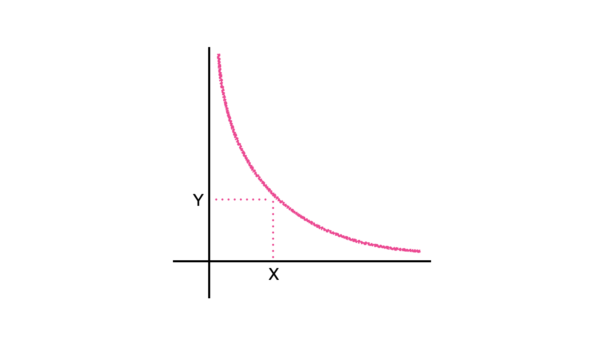
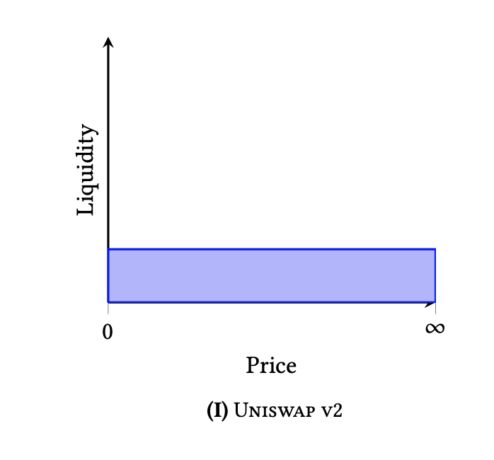
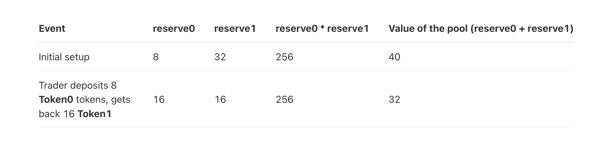

# Uniswap V1 - V2 이해하기

<br />

1. AMM, 유동성 공급자, 토큰 페어
2. CPMM, Hyperbola
3. Slippage
4. Swap
5. Add Liquidity
6. V1 vs V2

<br />

## 1. AMM, 유동성 공급자, 토큰 페어

Uniswap은 [DEX](https://www.coinbase.com/learn/crypto-basics/what-is-a-dex), 탈중앙화된 거래소로 ERC-20 토큰들을 거래/스왑할 수 있습니다. Uniswap을 필두로 현재 워킹하고있는 DEX들은 대부분 [오더북](https://en.wikipedia.org/wiki/Order_book) 방식을 사용하지 않고, [AMM(Automated Market Maker)](https://www.gemini.com/cryptopedia/amm-what-are-automated-market-makers)라 불리는 자동화된 알고리즘을 기반으로 작동합니다. 참고로 오더북은 기존의 주식 거래소에서 사용하는 방식으로, Uniswap보다 앞서서 블록체인 기반의 거래소를 만들고자했던 프로젝트들은 오더북 개념을 사용했으나 성공하지 못했습니다. 오더북 방식은 모든 매수/매도 주문을 저장하고 취소하는 일련의 과정이 따르는데 이로 인해 발생하는 막대한 Gas 비용, 네트워크 혼잡시 거래 지연으로 좋지 못한 UX, 여타 단점들로 인한 유동성 부족, 유동성 부족으로 인해 적정 가격에 거래가 체결되지 않는 문제 등 여러 단점들이 존재했기 때문입니다.

<br />

AMM을 구성하는 주요 요소는 가격 결정 알고리즘, 유동성 공급자, 토큰 페어인데, 가격 결정 알고리즘은 뒤에서 정리하기로 하고 나머지 두 개념은 각각 다음을 의미합니다.

- 토큰 페어: 스왑되는 토큰 쌍, Uniswap에서 두 토큰을 스왑한다는 것은, 해당 두 토큰 페어로 구성된 유동성 풀(Liquidity Pool)에 한 토큰을 넣고 다른 토큰을 빼는 것

- 유동성 공급자: 토큰 페어를 구성하는 두 토큰을 공급하여 거래소 유동성에 기여하는 주체, 보상으로 스왑 수수료의 대부분을 받음

<br />

## 2. CPMM, Hyperbola

### 2-1. 𝒙 × 𝒚 = 𝒌

가령 ETH/INCH 토큰 페어로 구성된 유동성 풀에서 한 사용자가 지불한 1 ETH에 대해 몇 개의 INCH 토큰을 내어줘야하는가 → 1 INCH의 가격은 얼마인가, 이를 결정하는 것이 바로 AMM의 가격 결정 알고리즘입니다. Uniswap은 AMM 모델 중에서도 CPMM(Constant Product Market Maker)을 사용하는데요, Uniswap V2까지 사용했던 CPMM 모델은 간단합니다. 두 토큰의 수량(Reserve)의 곱은 항상 일정하다, 수식으로 표현하면: _𝒙 × 𝒚 = 𝒌_

- 𝒙 : 토큰 X의 수량 (Reserve)

- 𝒚 : 토큰 Y의 수량

- 𝒌 : X/Y 페어 유동성

<br />

상수 𝒌는 어떤 스왑이 일어나도 변하지 않는 고정값이며, 이 값은 유동성이 추가되거나 제거될 때에만 변합니다. 토큰의 가격은 상수 𝒌를 유지하는 𝒙 / 𝒚 비율에 의해 결정됩니다.

> This is done by maintaining the relationship eth_pool * token_pool = invariant. This invariant is held constant during trades and only changes when liquidity is added or removed from the market. - [Uniswap Whitepaper](https://hackmd.io/@HaydenAdams/HJ9jLsfTz?type=view#ETH-%E2%87%84-ERC20-Trades)

> The token exchange price is determined by the ratio of 𝒙 and 𝒚 so that the product 𝒙 × 𝒚 is preserved. That is, when you sell △𝒙 tokens, you will get △𝒚 tokens such that 𝒙 × 𝒚 = (𝒙 + △𝒙) × (𝒚 - △𝒚). Thus, the price (△𝒙 / △𝒚) is the function of (𝒙 / 𝒚). - [Formal Specification of Constant Product (𝒙 × 𝒚) Market Maker Model and Implementation](https://github.com/runtimeverification/verified-smart-contracts/blob/uniswap/uniswap/x-y-k.pdf)

<br />

### 2-2. Hyperbola

CPMM 모델을 그래프로 그리면 아래와 같이 [Hyperbola](https://en.wikipedia.org/wiki/Hyperbola) 형태임을 알 수 있는데, 양 끝이 축에 닿지 않고 무한히 뻗어나가는 형태입니다. X, Y 중 어느 하나라도 0이 되면 고정된 상수 K 값을 유지할 수 없기 때문에, 어느 하나라도 0이 되는 거래는 일어나지 않는다는 것이 핵심입니다. CPMM의 이러한 특성때문에 유동성 풀이 고갈되지 않고 유지될 수 있는 것이고요!

> Hyperbola never crosses xxx or yyy, thus neither of the reserves is ever 0. This makes reserves infinite! - [Programming DeFi: Uniswap. Part 1 - Ivan Kuznetsov](https://medium.com/coinmonks/programming-defi-uniswap-part-1-839ebe796c7b)

<br />



<br />

[Uniswap Whitepaper](https://hackmd.io/@HaydenAdams/HJ9jLsfTz?type=view)에서 사용한 [Formalized CPMM](https://github.com/runtimeverification/verified-smart-contracts/blob/uniswap/uniswap/x-y-k.pdf) 문서를 통해 조금 더 정리해보겠습니다. (WIP)

<br />



사진 출처: [Uniswap v3 Core Whitepaper](https://uniswap.org/whitepaper-v3.pdf)

<br />

## 3. Slippage

CPMM의 단점은, 처음에 의도했던 가격과 실제 거래 가격 사이에 유의미한 차이가 발생하는 슬리피지(Slippage) 현상입니다. 슬리피지 현상은 값을 직접 대입해보면 더 빨리 와닿기 때문에, 다음과 같이 예를 들어 슬리피지를 확인하는 과정을 나열해보았습니다.

1. Uniswap의 ETH/INCH 풀에 10 ETH와 500 INCH가 공급되어 있다.

2. 그럼 K는 10 * 500 = 5000

3. 이 유동성 풀에 1 ETH를 넣고 INCH 토큰을 빼려고할 때 몇 개의 INCH를 받을 수 있을까? 수수료는 없다고 가정하고.

4. 1 ETH를 넣으면 풀에 존재하는 ETH의 수량은 11 ETH가 된다.

5. 스왑 후 풀에 남는 INCH의 수량은 (5000 / 11) 이어야 한다. 𝒙 × 𝒚 = 𝒌

6. 따라서, 풀에서 빼야 하는 INCH의 양은 500 - (5000 / 11) ≒ 45.5 INCH: 스왑 전 수량 - 스왑 후 수량

7. 자, 슬리피지가 발생했다.

8. 스왑 전에는 분명 1 ETH와 50 INCH 스왑이 가능해보였지만..

9. 막상 스왑을 하고나니 처음 의도했던 것보다 적은 INCH 토큰을 받았다. 이것이 슬리피지이다.

<br />

슬리피지는 유동성 규모가 클 수록 줄어듭니다. 만약 유동성 풀에 1000 ETH와 50000 INCH가 공급되어 있었다면, 1 ETH를 넣고 몇 개의 INCH 토큰을 받을 수 있을까요? K는 1000 * 50000 = 50000000, 스왑 후 INCH 토큰의 수량은 (50000000 / 1001), 유동성 풀에서 꺼내지는 INCH 토큰의 수량은 50000 - (50000000 / 1001) ≒ 49.9 INCH 입니다. 처음에 의도했던 50 INCH와 더욱 가까워졌습니다. 이 때문에 DEX에서 유동성의 규모를 확보하는 것이 매우 중요하고, DEX를 평가할 때도 [TVL(Total Value Locked)](https://coinmarketcap.com/alexandria/glossary/total-value-locked-tvl) 금액을 주요 지표로 사용합니다.

<br />

Uniswap V3부터는 Concentrated Liquidity, 집중화된 유동성을 도입하여 슬리피지 문제를 해소했는데 이에 대한 내용은 별도의 문서로 정리할 계획입니다.

<br />

## 4. Swap

Uniswap V2의 스왑 로직을 담은 Core Contract는 [`UniswapV2Pair`](https://github.com/Uniswap/v2-core/blob/master/contracts/UniswapV2Pair.sol)이고, 해당 Contract의 `swap()` 메소드를 보시면 됩니다. 이 `swap()` 메소드는 `external`이지만 외부에서 직접 호출시 작동하지 않고 [Periphery Contract](https://ethereum.org/en/developers/tutorials/uniswap-v2-annotated-code/#UniswapV2Router02)를 통해서만 호출되도록 설계되어 있다는 것이 중요합니다. [`UniswapV2Router02`](https://github.com/Uniswap/v2-periphery/blob/master/contracts/UniswapV2Router02.sol)가 해당 Periphery Contract이고요. 그러니까 외부에서 Uniswap Core Contract의 `swap()` 메소드를 호출하려면 `UniswapV2Router02` 컨트랙트를 통해야만 합니다. 이렇게 외부와의 Connector 역할을 하는 Contract를 Router라고도 부릅니다.

코드에 대한 분석은 주석으로 정리했습니다. 일부 주석은 실제 Contract에 원래 포함되어있는 것이기 때문에, 실제 Contract와 함께 확인하시는 것이 좋고요, 저의 주석은 `★` 표시로 구분했습니다. `★★★`로 표시한 부분은 코드 블록 아래에 별도로 정리했습니다.

<br />

### `UniswapV2Router02`

이 Periphery Contract에서는 `_swap()`이라는 `internal` 메소드를 통해 `UniswapV2Pair`의 `swap()` 메소드를 호출합니다. Contract를 살펴보면, `_swap()` 메소드는 몇 가지 `external` 함수들에서 호출되는데 아래의 코드 분석에서는 그 중 한 가지 메소드인 `swapExactTokensForTokens()` 메소드만 다루었습니다.

```solidity
pragma solidity =0.6.6;

import '@uniswap/v2-core/contracts/interfaces/IUniswapV2Factory.sol';
import '@uniswap/lib/contracts/libraries/TransferHelper.sol';

import './interfaces/IUniswapV2Router02.sol';
import './libraries/UniswapV2Library.sol';
import './libraries/SafeMath.sol';
import './interfaces/IERC20.sol';
import './interfaces/IWETH.sol';

contract UniswapV2Router02 is IUniswapV2Router02 {
    // ★ 유효 범위를 넘치면 숫자가 Reset되는 것을 막기 위해 SafeMath 라이브러리 사용
    using SafeMath for uint;

    address public immutable override factory;
    address public immutable override WETH;

    // ★ Deadline이 남았는지 검사하는 modifier
    modifier ensure(uint deadline) {
        require(deadline >= block.timestamp, 'UniswapV2Router: EXPIRED');
        _;
    }

    constructor(address _factory, address _WETH) public {
        factory = _factory;
        WETH = _WETH;
    }

    // ABBR .....

    // ★ swapExactTokensForTokens() 부터 보세요
    // **** SWAP ****
    // requires the initial amount to have already been sent to the first pair
    function _swap(uint[] memory amounts, address[] memory path, address _to) internal virtual {
        for (uint i; i < path.length - 1; i++) {
            // ★ 스왑하는 두 토큰 주소
            (address input, address output) = (path[i], path[i + 1]);
            (address token0,) = UniswapV2Library.sortTokens(input, output);

            // ★ 풀에서 꺼내야하는 토큰 금액 △𝒚
            uint amountOut = amounts[i + 1];

            // ★ In 토큰의 amountOut은 0, Out 토큰의 amountOut은 △𝒚 으로 세팅
            (uint amount0Out, uint amount1Out) = input == token0 ? (uint(0), amountOut) : (amountOut, uint(0));

            // ★ 스왑 토큰의 수가 3 이상이면, Out 토큰과 제3 토큰의 Uniswap 토큰페어 주소를 가져오고
            // ★ 그게 아니라면, 인자로 받은 _to를 할당
            address to = i < path.length - 2 ? UniswapV2Library.pairFor(factory, output, path[i + 2]) : _to;

            // ★★★ 3) swap
            IUniswapV2Pair(UniswapV2Library.pairFor(factory, input, output)).swap(
                amount0Out, amount1Out, to, new bytes(0)
            );
        }
    }

    // ★ In 토큰의 수량을 명시하고, 그에 맞는 양만큼 페어 토큰을 Out 하고자 할 때
    function swapExactTokensForTokens(
        uint amountIn,
        uint amountOutMin,
        address[] calldata path,
        address to,
        uint deadline
    ) external virtual override ensure(deadline) returns (uint[] memory amounts) {
        // ★★★ 1) amounts = [amonutIn, amountOut, ..]
        amounts = UniswapV2Library.getAmountsOut(factory, amountIn, path);

        // ★ Slippage Tolerance를 넘지 않는지 확인!
        require(amounts[amounts.length - 1] >= amountOutMin, 'UniswapV2Router: INSUFFICIENT_OUTPUT_AMOUNT');

        // ★★★ 2) In 토큰을 사용자의 주소에서 Uniswap의 토큰페어 주소로 전송시킨다
        TransferHelper.safeTransferFrom(
            path[0], msg.sender, UniswapV2Library.pairFor(factory, path[0], path[1]), amounts[0]
        );

        // ★ 이제 스왑하자
        _swap(amounts, path, to);
    }

    // ABBR .....
}
```

<br />

#### `★★★ 1)`

```solidity
        // ★★★ 1) amounts[0] → amonutIn, amounts[1] → amountOut
        amounts = UniswapV2Library.getAmountsOut(factory, amountIn, path);
```

<br />

`getAmountsOut()`은 풀에서 꺼내야하는 토큰의 수량을 계산하여 반환하는 메소드인데, 여기에서 가격 결정 알고리즘 CPMM을 사용하여 꺼내야하는 토큰의 수량 `△𝒚`를 구하는 로직을 확인할 수 있습니다. 다음과 같이 도출되는 `△𝒚 = (△𝒙 × 𝒚) / (𝒙 + △𝒙)` 방정식이 사용됩니다. [`UniswapV2Library`](https://github.com/Uniswap/v2-periphery/blob/master/contracts/libraries/UniswapV2Library.sol) 라이브러리에서 이 메소드를 찾을 수 있습니다.

```
(𝒙 + △𝒙) × (𝒚 - △𝒚) = 𝒙 × 𝒚 = 𝒌
(𝒙 + △𝒙) × (𝒚 - △𝒚) = 𝒙𝒚
𝒚 - △𝒚 = 𝒙𝒚 / (𝒙 + △𝒙)
△𝒚 = 𝒚 - (𝒙𝒚 / (𝒙 + △𝒙))

∴ △𝒚 = (△𝒙 × 𝒚) / (𝒙 + △𝒙)
```

<br />

```solidity
pragma solidity >=0.5.0;

import '@uniswap/v2-core/contracts/interfaces/IUniswapV2Pair.sol';

import "./SafeMath.sol";

library UniswapV2Library {
    using SafeMath for uint;

    // ABBR .....

    // given an input amount of an asset and pair reserves, returns the maximum output amount of the other asset
    function getAmountOut(uint amountIn, uint reserveIn, uint reserveOut) internal pure returns (uint amountOut) {
        // ★ In 토큰의 수량이 0보다 큰지, 토큰 페어의 유동성이 고갈되지 않았는지 검사
        require(amountIn > 0, 'UniswapV2Library: INSUFFICIENT_INPUT_AMOUNT');
        require(reserveIn > 0 && reserveOut > 0, 'UniswapV2Library: INSUFFICIENT_LIQUIDITY');

        // ★ 수수료 0.3%을 제하고 유동성 풀에 들어오는 △𝒙 × 1000 
        // ★ → 수수료는 유동성 풀에 남지 않으므로 이를 제한 △𝒙를 사용하여 △𝒚를 계산!
        // ★ → Solidity에서 int round를 피하기 위해 1000을 곱하여 정수로 만들어 계산함!
        uint amountInWithFee = amountIn.mul(997);
        // ★ △𝒙 × 𝒚 × 1000
        uint numerator = amountInWithFee.mul(reserveOut);
        // ★ (𝒙 + △𝒙) × 1000
        uint denominator = reserveIn.mul(1000).add(amountInWithFee);
        // ★ △𝒚 = (△𝒙 × 𝒚) / (𝒙 + △𝒙)
        amountOut = numerator / denominator;
    }

    // ABBR .....

    // performs chained getAmountOut calculations on any number of pairs
    function getAmountsOut(address factory, uint amountIn, address[] memory path) internal view returns (uint[] memory amounts) {
        // ★ In/Out 최소 2 가지 토큰 주소를 받았는지 확인
        require(path.length >= 2, 'UniswapV2Library: INVALID_PATH');

        // ★ 첫 번째 path에 대응하는 amount에는 In 토큰의 수량을 대입
        amounts = new uint[](path.length);
        amounts[0] = amountIn;

        for (uint i; i < path.length - 1; i++) {
            // ★ In/Out 토큰의 유동성 풀 Reserve를 각각 가져온 후
            (uint reserveIn, uint reserveOut) = getReserves(factory, path[i], path[i + 1]);
            // ★ Out 토큰의 수량을 저장
            amounts[i + 1] = getAmountOut(amounts[i], reserveIn, reserveOut);
        }
    }
}
```

<br />

#### `★★★ 2)`

```solidity
        TransferHelper.safeTransferFrom(
            path[0], msg.sender, UniswapV2Library.pairFor(factory, path[0], path[1]), amounts[0]
        );
```

<br />

[`TransferHelper`](https://github.com/Uniswap/solidity-lib/blob/master/contracts/libraries/TransferHelper.sol) 라이브러리를 확인해보면 `safeTransferFrom(address token, address from, address to, uint256 value)`의 두 번째 인자는 해당 ERC20 토큰을 받는 주소임을 알 수 있습니다. 두 번째 인자로 넘겨진 `UniswapV2Library.pairFor(factory, path[0], path[1])`은 [`UniswapV2Library`](https://github.com/Uniswap/v2-periphery/blob/master/contracts/libraries/UniswapV2Library.sol) 라이브러리에서 찾아볼 수 있는데, 스왑하는 두 토큰의 Uniswap 토큰 페어 주소를 반환합니다. 결국 두 토큰의 스왑을 위해 사용자에게 받은 In 토큰을 토큰 페어 주소에서 받은 후 미리 홀드하고 있음을 알 수 있습니다. 이 시점에 해당 토큰 페어 주소의 In 토큰 Balance는 `𝒙 + ◻︎𝒙` 이고, 여기에서 `◻︎𝒙`는 아직 수수료를 제하지 않은 금액입니다.

<br />

#### `★★★ 3)`

```solidity
        IUniswapV2Pair(UniswapV2Library.pairFor(factory, input, output)).swap(
            amount0Out, amount1Out, to, new bytes(0)
        );
```

<br />

[`IUniswapV2Pair`](https://github.com/Uniswap/v2-core/blob/master/contracts/interfaces/IUniswapV2Pair.sol) 인터페이스를 사용하여 토큰 페어 주소로 `UniswapV2Pair` 인스턴스를 만듭니다. 이 토큰 페어 주소는 바로 위 `★★★ 2)` 주석에서 설명한 주소와 같은 주소입니다. `𝒙 + ◻︎𝒙`만큼의 잔고를 보유하고 있습니다. 세 번째 인자로는 Dummy 데이터인 `new bytes(0)`를 넣습니다. 해당 메소드의 세 번째 인자는 [Flash Swap](https://uniswap.org/blog/uniswap-v2#flash-swaps)의 경우에 유효한 데이터를 넣어주기 위한 용도인데, 여기서는 일반 Swap에 집중하기 위해 넘어가겠습니다.

<br />

### `UniswapV2Pair`

드디어 [`UniswapV2Pair`](https://github.com/Uniswap/v2-core/blob/master/contracts/UniswapV2Pair.sol) Contract를 봅니다.

```solidity
pragma solidity =0.5.16;

contract UniswapV2Pair is IUniswapV2Pair, UniswapV2ERC20 {
    using SafeMath  for uint;
    using UQ112x112 for uint224;

    uint public constant MINIMUM_LIQUIDITY = 10**3;
    bytes4 private constant SELECTOR = bytes4(keccak256(bytes('transfer(address,uint256)')));

    address public factory;
    address public token0;
    address public token1;

    uint112 private reserve0;           // uses single storage slot, accessible via getReserves
    uint112 private reserve1;           // uses single storage slot, accessible via getReserves
    uint32  private blockTimestampLast; // uses single storage slot, accessible via getReserves

    uint public price0CumulativeLast;
    uint public price1CumulativeLast;
    uint public kLast; // reserve0 * reserve1, as of immediately after the most recent liquidity event

    // ★ lock modifier는 한 번에 한 명의 사용자만 스왑할 수 있도록 함수들을 일시적으로 Lock
    uint private unlocked = 1;
    modifier lock() {
        require(unlocked == 1, 'UniswapV2: LOCKED');
        unlocked = 0;
        _;
        unlocked = 1;
    }

    // ★ 초기 Reserve를 memory 변수에 담은 후 반환 → 향후 계산에 사용되므로 가스비 절감을 위해 memory 변수를 사용
    function getReserves() public view returns (uint112 _reserve0, uint112 _reserve1, uint32 _blockTimestampLast) {
        _reserve0 = reserve0;
        _reserve1 = reserve1;
        _blockTimestampLast = blockTimestampLast;
    }

    function _safeTransfer(address token, address to, uint value) private {
        (bool success, bytes memory data) = token.call(abi.encodeWithSelector(SELECTOR, to, value));
        require(success && (data.length == 0 || abi.decode(data, (bool))), 'UniswapV2: TRANSFER_FAILED');
    }
    
    // ABBR .....

    constructor() public {
        factory = msg.sender;
    }

    // called once by the factory at time of deployment
    function initialize(address _token0, address _token1) external {
        require(msg.sender == factory, 'UniswapV2: FORBIDDEN'); // sufficient check
        token0 = _token0;
        token1 = _token1;
    }

    // ★ swap() 에서 호출되므로 swap()을 먼저 보세요.
    // ★ swap()을 통해 balance0, balance1은 각각 𝒙 + ◻︎𝒙, 𝒚 - △𝒚 이 넘어옵니다
    // update reserves and, on the first call per block, price accumulators
    function _update(uint balance0, uint balance1, uint112 _reserve0, uint112 _reserve1) private {
        // ★ Overflow 체크
        require(balance0 <= uint112(-1) && balance1 <= uint112(-1), 'UniswapV2: OVERFLOW');

        // ★ 현재 Timestamp
        uint32 blockTimestamp = uint32(block.timestamp % 2**32);

        // ★ 이 토큰 페어에 대한 마지막 블록 생성 후 경과된 시간
        uint32 timeElapsed = blockTimestamp - blockTimestampLast; // overflow is desired

        // ★ 직전 블록 생성시 결정된 가격에 경과된 시간 만큼을 곱하여 priceCumulativeLast를 각 토큰에 대해 구함 → Price Oracle용
        if (timeElapsed > 0 && _reserve0 != 0 && _reserve1 != 0) {
            // * never overflows, and + overflow is desired
            price0CumulativeLast += uint(UQ112x112.encode(_reserve1).uqdiv(_reserve0)) * timeElapsed;
            price1CumulativeLast += uint(UQ112x112.encode(_reserve0).uqdiv(_reserve1)) * timeElapsed;
        }

        // ★ 유동성 Reserve를 𝒙 + ◻︎𝒙, 𝒚 - △𝒚로 업데이트
        reserve0 = uint112(balance0);
        reserve1 = uint112(balance1);

        // ★ 마지막 블록 생성 시간 업데이트
        blockTimestampLast = blockTimestamp;

        emit Sync(reserve0, reserve1);
    }
    
    // ABBR .....

    // this low-level function should be called from a contract which performs important safety checks
    function swap(uint amount0Out, uint amount1Out, address to, bytes calldata data) external lock {
        require(amount0Out > 0 || amount1Out > 0, 'UniswapV2: INSUFFICIENT_OUTPUT_AMOUNT');
        (uint112 _reserve0, uint112 _reserve1,) = getReserves(); // gas savings ★ → 가스비 절감을 위해 메모리 변수에 담아서 사용!
        require(amount0Out < _reserve0 && amount1Out < _reserve1, 'UniswapV2: INSUFFICIENT_LIQUIDITY');

        uint balance0;
        uint balance1;
        { // scope for _token{0,1}, avoids stack too deep errors
        // ★ 스왑하는 두 토큰의 주소를 메모리에 저장
        address _token0 = token0;
        address _token1 = token1;

        // ★ 스왑 사용자의 주소가 유효한지 검사
        require(to != _token0 && to != _token1, 'UniswapV2: INVALID_TO');

        // ★ Out 수량이 0이 아닌 토큰을 사용자 주소로 △𝒚 만큼 전송
        if (amount0Out > 0) _safeTransfer(_token0, to, amount0Out); // optimistically transfer tokens
        if (amount1Out > 0) _safeTransfer(_token1, to, amount1Out); // optimistically transfer tokens

        // ★ Flash Swap의 경우에만 data의 길이가 존재
        if (data.length > 0) IUniswapV2Callee(to).uniswapV2Call(msg.sender, amount0Out, amount1Out, data);

        // ★★★ 1) 이 토큰 페어의 주소가 보유하고 있는 각 토큰 Balance를 가져옴
        balance0 = IERC20(_token0).balanceOf(address(this));
        balance1 = IERC20(_token1).balanceOf(address(this));
        }

        // ★★★ 2)
        // ★ In 토큰이면 balance == 𝒙 + ◻︎𝒙(수수료 포함), _reserve == 𝒙, amountOut == 0 → amountIn = ◻︎𝒙
        // ★ Out 토큰이면 balance == 𝒚 - △𝒚, _reserve == 𝒚, amountOut == △𝒚 → amountIn = 0
        uint amount0In = balance0 > _reserve0 - amount0Out ? balance0 - (_reserve0 - amount0Out) : 0;
        uint amount1In = balance1 > _reserve1 - amount1Out ? balance1 - (_reserve1 - amount1Out) : 0;

        // ★ 토큰 페어 주소의 Balance에 ◻︎𝒙가 포함되어있지 않으면, amount0In, amount1In 모두 0일테니 더블체크!
        require(amount0In > 0 || amount1In > 0, 'UniswapV2: INSUFFICIENT_INPUT_AMOUNT');
        { // scope for reserve{0,1}Adjusted, avoids stack too deep errors

        // ★★★ 3)
        // ★ balanceAdjusted = 수수료 0.3%를 제하고 유동성 풀에 남아야하는 𝒙 × 1000
        // ★ ((𝒙 + ◻︎𝒙) × 1000) - (◻︎𝒙 × 3) ⇒ (𝒙 × 1000) + (◻︎𝒙 × 997)
        // ★ △𝒙 = ◻︎𝒙 × 0.997
        uint balance0Adjusted = balance0.mul(1000).sub(amount0In.mul(3));
        uint balance1Adjusted = balance1.mul(1000).sub(amount1In.mul(3));

        // ★★★ 4)
        // ★ 𝒌가 건재한지 확인
        // ★ ((𝒙 + △𝒙) × 1000) × ((𝒚 - △𝒚) × 1000) >= _reserve0 × _reserve1 × 1000 × 1000 = 𝒌
        require(balance0Adjusted.mul(balance1Adjusted) >= uint(_reserve0).mul(_reserve1).mul(1000**2), 'UniswapV2: K');
        }

        // ★ 유동성 풀의 Reserve 업데이트 (𝒙 + ◻︎𝒙, 𝒚 - △𝒚를 인자로 넘긴다)
        _update(balance0, balance1, _reserve0, _reserve1);

        // ★ Swap 이벤트 전송
        emit Swap(msg.sender, amount0In, amount1In, amount0Out, amount1Out, to);
    }   
}
```

<br />

#### `★★★ 1)`

```solidity
        balance0 = IERC20(_token0).balanceOf(address(this));
        balance1 = IERC20(_token1).balanceOf(address(this));
```

<br />

여기에서 Balance를 가져올 때 사용하는 주소 `address(this)`는 `UniswapV2Pair` 인스턴스를 만들 때 사용했던 주소입니다. 사용자에게 In 토큰 `◻︎𝒙`만큼을 전송받았다는 사실을 기억하세요. 이게 바로 외부에서 바로 호출되지 않고 Periphery Contract를 통했는지 체크하는 Uniswap의 장치입니다. 이러한 장치없이 Core Contract인 `UniswapV2Pair`에서 토큰을 주고받는 모든 일을 처리한다면 Cheat 위험이 있기 때문입니다. 여기에서 말하는 Periphery contract는 [UniswapV2Router02](https://github.com/Uniswap/v2-periphery/blob/master/contracts/UniswapV2Router02.sol)입니다.

> Get the current balances. The periphery contract sends us the tokens before calling us for the swap. This makes it easy for the contract to check that it is not being cheated, a check that has to happen in the core contract (because we can be called by other entities than our periphery contract). - [UNISWAP-V2 CONTRACT WALK-THROUGH | Ethereum](https://ethereum.org/en/developers/tutorials/uniswap-v2-annotated-code/)

<br />

#### `★★★ 2)`

```solidity
        // ★ In 토큰이면 balance == 𝒙 + ◻︎𝒙(수수료 포함), _reserve == 𝒙, amountOut == 0 → amountIn = ◻︎𝒙
        // ★ Out 토큰이면 balance == 𝒚 - △𝒚, _reserve == 𝒚, amountOut == △𝒚 → amountIn = 0
        uint amount0In = balance0 > _reserve0 - amount0Out ? balance0 - (_reserve0 - amount0Out) : 0;
        uint amount1In = balance1 > _reserve1 - amount1Out ? balance1 - (_reserve1 - amount1Out) : 0;
```

<br />

위에서 Out 토큰 `△𝒚`만큼을 이미 사용자 주소로 전송했으므로, Out 토큰의 경우 `balance == 𝒚 - △𝒚`가 성립합니다. 따라서 `amountIn`은 `0`이 되겠네요.

<br />

#### `★★★ 3)`

```solidity
        // ★ balanceAdjusted = 수수료 0.3%를 제하고 유동성 풀에 남아야하는 𝒙 × 1000
        // ★ ((𝒙 + ◻︎𝒙) × 1000) - (◻︎𝒙 × 3) ⇒ (𝒙 × 1000) + (◻︎𝒙 × 997)
        // ★ △𝒙 = ◻︎𝒙 × 0.997
        uint balance0Adjusted = balance0.mul(1000).sub(amount0In.mul(3));
        uint balance1Adjusted = balance1.mul(1000).sub(amount1In.mul(3));
```

<br />

Out 토큰의 경우 다음이 성립합니다: `(𝒚 - △𝒚) × 1000 - 0`

<br />

#### `★★★ 4)`

```solidity
        // ★ 𝒌가 건재한지 확인
        // ★ ((𝒙 + △𝒙) × 1000) × ((𝒚 - △𝒚) × 1000) >= _reserve0 × _reserve1 × 1000 × 1000 = 𝒌
        require(balance0Adjusted.mul(balance1Adjusted) >= uint(_reserve0).mul(_reserve1).mul(1000**2), 'UniswapV2: K');
```

<br />

수수료를 제하고도 CPMM 모델의 상수 `𝒌`가 건재한지 확인합니다. Uniswap에서는 스왑이 일어나는 즉시 수수료가 정산되는 것은 아니므로 유동성 풀에는 수수료를 제하지 않은 `◻︎𝒙`만큼의 Reserve가 추가되지만, 유동성 공급자들이 언제든 수수료를 청구해서 가져가더라도 `𝒌` 값은 일정해야하므로 이를 체크합니다.

> This is a sanity check to make sure we don't lose from the swap. There is no circumstance in which a swap should reduce reserve0*reserve1. - [UNISWAP-V2 CONTRACT WALK-THROUGH | Ethereum](https://ethereum.org/en/developers/tutorials/uniswap-v2-annotated-code/)

<br />

## 5. Add Liquidity

이번에는 유동성 추가 로직을 정리하려고 합니다. 유동성이 추가되면 CPMM 모델의 상수 `𝒌` 값이 변한다는 것을 기억하시고요. 스왑과 마찬가지로 외부에서 유동성 추가 함수를 호출하려면 Periphery Contract인 [`UniswapV2Router02`](https://github.com/Uniswap/v2-periphery/blob/master/contracts/UniswapV2Router02.sol)를 통합니다.

<br />

### `addLiquidity`

```solidity
pragma solidity =0.6.6;

import '@uniswap/v2-core/contracts/interfaces/IUniswapV2Factory.sol';
import '@uniswap/lib/contracts/libraries/TransferHelper.sol';

import './interfaces/IUniswapV2Router02.sol';
import './libraries/UniswapV2Library.sol';
import './libraries/SafeMath.sol';
import './interfaces/IERC20.sol';
import './interfaces/IWETH.sol';

contract UniswapV2Router02 is IUniswapV2Router02 {

    // ABBR .....

    // ★ addLiquidity() 함수 내에서 호출됩니다
    // **** ADD LIQUIDITY ****
    function _addLiquidity(
        address tokenA,
        address tokenB,
        uint amountADesired,
        uint amountBDesired,
        uint amountAMin,
        uint amountBMin
    ) internal virtual returns (uint amountA, uint amountB) {
        // ★★★ 1) 해당 토큰 페어의 주소가 존재하지 않으면 페어를 새로 만듭니다
        // create the pair if it doesn't exist yet
        if (IUniswapV2Factory(factory).getPair(tokenA, tokenB) == address(0)) {
            IUniswapV2Factory(factory).createPair(tokenA, tokenB);
        }

        // ★ 두 토큰의 Reserve 가져옴
        (uint reserveA, uint reserveB) = UniswapV2Library.getReserves(factory, tokenA, tokenB);

        // ★ 두 토큰의 Reserve가 0이면 (토큰 페어에 유동성을 처음 공급하는 거라면) 원하는 금액을 저장
        if (reserveA == 0 && reserveB == 0) {
            (amountA, amountB) = (amountADesired, amountBDesired);
        } else {
            // ★★★ 2) 
            // ★ 이미 유동성 풀에 Reserve가 존재하므로, 기존 토큰 비율을 유지하면서 유동성을 공급하기 위해 amountBOptimal(𝑳𝒚)를 계산
            uint amountBOptimal = UniswapV2Library.quote(amountADesired, reserveA, reserveB);

            if (amountBOptimal <= amountBDesired) {
                // ★ 최적 공급량 𝑳𝒚가 amountBMin 이상인가 → If not, revert!
                require(amountBOptimal >= amountBMin, 'UniswapV2Router: INSUFFICIENT_B_AMOUNT');

                // ★ 최종적으로 공급될 두 토큰 금액
                (amountA, amountB) = (amountADesired, amountBOptimal);
            } else {
                // ★ 희망 공급량이 최적 공급량 𝑳𝒚보다 적으면 기준 토큰을 바꿔서 확인
                // ★ 기존 토큰 비율을 유지하면서 유동성을 공급하기 위해 amountAOptimal(𝒙)를 계산 
                uint amountAOptimal = UniswapV2Library.quote(amountBDesired, reserveB, reserveA);

                // ★ 희망 공급량이 최적 공급량 𝑳𝒙 이상이어야 함 (이미 𝑳𝒚는 충족하지 못했으니까 노빠꾸)
                assert(amountAOptimal <= amountADesired);

                // ★ 최적 공급량 𝑳𝒙가 amountAMin 이상인가 → If not, revert!
                require(amountAOptimal >= amountAMin, 'UniswapV2Router: INSUFFICIENT_A_AMOUNT');

                // ★ 최종적으로 공급 가능한 두 토큰 금액 𝑳𝒙, 𝑳𝒚
                (amountA, amountB) = (amountAOptimal, amountBDesired);
            }
        }
    }

    function addLiquidity(
        address tokenA,
        address tokenB,
        uint amountADesired,
        uint amountBDesired,
        uint amountAMin,
        uint amountBMin,
        address to,
        uint deadline
    ) external virtual override ensure(deadline) returns (uint amountA, uint amountB, uint liquidity) {
        // ★ _addLiquidity 호출 → 토큰 가격을 유지하는 각 토큰의 최적 공급량을 반환함
        (amountA, amountB) = _addLiquidity(tokenA, tokenB, amountADesired, amountBDesired, amountAMin, amountBMin);

        // ★ 토큰 페어 주소를 가져옴
        address pair = UniswapV2Library.pairFor(factory, tokenA, tokenB);

        // ★ 두 토큰을 토큰 페어 주소로 전송
        TransferHelper.safeTransferFrom(tokenA, msg.sender, pair, amountA);
        TransferHelper.safeTransferFrom(tokenB, msg.sender, pair, amountB);

        // ★ 해당 토큰 페어에 대한 LP토큰 발행! → 아래에서 별도의 하위 섹션으로 다룰게요
        liquidity = IUniswapV2Pair(pair).mint(to);
    }

    // ABBR .....
}
```

<br />

#### `★★★ 1)`

```solidity
        // create the pair if it doesn't exist yet
        if (IUniswapV2Factory(factory).getPair(tokenA, tokenB) == address(0)) {
            IUniswapV2Factory(factory).createPair(tokenA, tokenB);
        }
```

<br />

`IUniswapV2Factory(factory).getPair(tokenA, tokenB)`는 해당 토큰 페어의 주소를 반환하고, 주소가 존재하지 않으면 새로운 페어를 만들기 위해 `createPair(tokenA, tokenB)` 메소드를 호출하여 새로운 페어를 생성합니다. [`UniswapV2Factory`](https://github.com/Uniswap/v2-core/blob/master/contracts/UniswapV2Factory.sol) Contract에서 확인할 수 있습니다.

<br />

#### `★★★ 2)`

```solidity
        // ★ 이미 유동성 풀에 Reserve가 존재하므로, 기존 토큰 비율을 유지하면서 유동성을 공급하기 위해 amountBOptimal(𝑳𝒚)를 계산
        uint amountBOptimal = UniswapV2Library.quote(amountADesired, reserveA, reserveB);
```

<br />

[`UniswapV2Library`](https://github.com/Uniswap/v2-periphery/blob/master/contracts/libraries/UniswapV2Library.sol)에서 확인해보면 토큰 A를 `𝑳𝒙`만큼 넣고자할 때 최적의 B 금액 `𝑳𝒚`는 다음과 같이 결정됩니다.

```solidity
pragma solidity >=0.5.0;

import '@uniswap/v2-core/contracts/interfaces/IUniswapV2Pair.sol';

import "./SafeMath.sol";

library UniswapV2Library {

    // ABBR .....

    // given some amount of an asset and pair reserves, returns an equivalent amount of the other asset
    function quote(uint amountA, uint reserveA, uint reserveB) internal pure returns (uint amountB) {
        // ★ 공급하려는 𝑳𝒙가 0보다 커야함
        require(amountA > 0, 'UniswapV2Library: INSUFFICIENT_AMOUNT');

        // ★ 유동성 풀에 이미 존재하는 두 토큰의 Reserve 𝒙, 𝒚 모두 0보다 커야함
        require(reserveA > 0 && reserveB > 0, 'UniswapV2Library: INSUFFICIENT_LIQUIDITY');

        // ★ 토큰 가격에 영향을 주면 안되므로 기존 비율을 지킵니다
        // ★ 𝒙 : 𝒚 = 𝑳𝒙 : 𝑳𝒚 → 𝑳𝒚 = (𝑳𝒙 × 𝒚) / 𝒙
        amountB = amountA.mul(reserveB) / reserveA;
    }

    // ABBR .....
}
```

<br />

### `IUniswapV2Pair.mint`

```solidity
        liquidity = IUniswapV2Pair(pair).mint(to);
```

<br />

[`IUniswapV2Pair`](https://github.com/Uniswap/v2-core/blob/master/contracts/interfaces/IUniswapV2Pair.sol) 인터페이스의 `mint()` 메소드는 [ERERC-20 토큰 스탠다드](https://ethereum.org/ko/developers/docs/standards/tokens/erc-20/)를 따른 것으로, 토큰 페어에서 자체 토큰을 민팅하고 소각할 수 있게끔 설계되었다는 것을 알 수 있습니다. 각 토큰 페어에서 민팅되는 토큰들은 해당 토큰 페어에 대한 LP토큰으로 사용됩니다. `mint()` 메소드의 구현 내용은 [`UniswapV2Pair`](https://github.com/Uniswap/v2-core/blob/master/contracts/UniswapV2Pair.sol)에서 확인할 수 있습니다.

Uniswap V2부터는 사용자가 지불하는 수수료 0.3% 중에서 0.05%에 해당하는 보상을 Uniswap이 지정한 특정 주소로 전송되도록 했습니다. Protocol 수수료 명목으로, Uniswap 개발팀에게 보상이 주어지도록 말이죠. 나머지 0.25%는 기존과 같이 유동성 공급자에게 돌아갑니다. Protocol 수수료에 해당하는 만큼 LP토큰을 민팅하여 지정된 수령 주소로 보내는 방식입니다.

> In Uniswap 2.0 traders pay a 0.30% fee to use the market. Most of that fee (0.25% of the trade) always goes to the liquidity providers. The remaining 0.05% can go either to the liquidity providers or to an address specified by the factory as a protocol fee, which pays Uniswap for their development effort. - [UNISWAP-V2 CONTRACT WALK-THROUGH](https://ethereum.org/en/developers/tutorials/uniswap-v2-annotated-code/)

<br />

```solidity
pragma solidity =0.5.16;

import './interfaces/IUniswapV2Pair.sol';
import './UniswapV2ERC20.sol';
import './libraries/Math.sol';
import './libraries/UQ112x112.sol';
import './interfaces/IERC20.sol';
import './interfaces/IUniswapV2Factory.sol';
import './interfaces/IUniswapV2Callee.sol';

contract UniswapV2Pair is IUniswapV2Pair, UniswapV2ERC20 {

    // ABBR .....

    // ★ mint() 먼저 보세요
    // if fee is on, mint liquidity equivalent to 1/6th of the growth in sqrt(k)
    function _mintFee(uint112 _reserve0, uint112 _reserve1) private returns (bool feeOn) {
        // ★ Protocol 수수료 수령 주소
        address feeTo = IUniswapV2Factory(factory).feeTo();

        // ★ Protocol 수수료 존재 여부
        feeOn = feeTo != address(0);

        uint _kLast = kLast; // gas savings ★ → memory 변수에 담아서 연산에 사용

        if (feeOn) {
            if (_kLast != 0) {
                // ★★★ 1)
                // ★ rootK = √(𝒙𝒚)
                // ★ rootKLast = √𝒌
                uint rootK = Math.sqrt(uint(_reserve0).mul(_reserve1));
                uint rootKLast = Math.sqrt(_kLast);
                
                // ★ If there is new liquidity on which to collect a protocol fee
                if (rootK > rootKLast) {
                    // ★ 백서 p.5 참고 → https://uniswap.org/whitepaper.pdf
                    uint numerator = totalSupply.mul(rootK.sub(rootKLast));
                    uint denominator = rootK.mul(5).add(rootKLast);
                    uint liquidity = numerator / denominator;

                    // ★ Protocol 수수료 수령 주소로 토큰 민팅
                    if (liquidity > 0) _mint(feeTo, liquidity);
                }
            }
        } else if (_kLast != 0) {
            kLast = 0;
        }
    }
    
    // this low-level function should be called from a contract which performs important safety checks
    function mint(address to) external lock returns (uint liquidity) {
        (uint112 _reserve0, uint112 _reserve1,) = getReserves(); // gas savings ★ → memory에 저장한 후 연산에 사용

        // ★ 토큰 페어의 각 토큰 Balance (𝒙 + 𝑳𝒙), (𝒚 + 𝑳𝒚)
        uint balance0 = IERC20(token0).balanceOf(address(this));
        uint balance1 = IERC20(token1).balanceOf(address(this));

        // ★ 아직 블록에 _reserve0, _reserve1 업데이트가 되지 않았으므로, 해당 값을 빼서 이번에 추가된 공급량 𝑳𝒙, 𝑳𝒚 가져옴
        uint amount0 = balance0.sub(_reserve0);
        uint amount1 = balance1.sub(_reserve1);

        // ★ Protocol 수수료 존재시, 수령 주소로 토큰 민팅
        bool feeOn = _mintFee(_reserve0, _reserve1);

        uint _totalSupply = totalSupply; // gas savings, must be defined here since totalSupply can update in _mintFee

        if (_totalSupply == 0) {
            // ★★★ 2)
            // ★ 최초 유동성 공급시, 기여하는 유동성 규모 = √(𝑳𝒙 × 𝑳𝒚) - 𝑳𝒎𝒊𝒏
            // ★ ∵ 아직 두 토큰의 상대적 가치가 존재하지 않기 때문에, 두 토큰의 가치가 같다고 가정
            liquidity = Math.sqrt(amount0.mul(amount1)).sub(MINIMUM_LIQUIDITY);

            // ★★★ 3)
            // ★ 최소 유동성 𝑳𝒎𝒊𝒏에 해당하는 만큼의 LP토큰을 주소0으로 민팅해서 영원히 Lock
           _mint(address(0), MINIMUM_LIQUIDITY); // permanently lock the first MINIMUM_LIQUIDITY tokens
        } else {
            // ★★★ 4)
            // ★ 다음 둘 중 더 적은 값을 기여도로 결정
            // ★ (𝑳𝒙 × 𝑻𝒐𝒕𝒂𝒍) / 𝒙
            // ★ (𝑳𝒚 × 𝑻𝒐𝒕𝒂𝒍) / 𝒚
            liquidity = Math.min(amount0.mul(_totalSupply) / _reserve0, amount1.mul(_totalSupply) / _reserve1);
        }

        require(liquidity > 0, 'UniswapV2: INSUFFICIENT_LIQUIDITY_MINTED');

        // ★ 기여하는 유동성 규모에 따라 LP토큰을 민팅해줌!
        _mint(to, liquidity);

        // ★ 토큰 페어 Reserve 업데이트
        _update(balance0, balance1, _reserve0, _reserve1);

        // ★ (𝒙 + 𝑳𝒙) × (𝒚 + 𝑳𝒚) = 𝒌𝒏𝒆𝒘
        if (feeOn) kLast = uint(reserve0).mul(reserve1); // reserve0 and reserve1 are up-to-date

        // ★ 이벤트로 알려주기
        emit Mint(msg.sender, amount0, amount1);
    }

    // ABBR .....
}
```

<br />

#### `★★★ 1)`

```solidity
            // ★ rootK = √(𝒙𝒚)
            // ★ rootKLast = √𝒌
            uint rootK = Math.sqrt(uint(_reserve0).mul(_reserve1));
            uint rootKLast = Math.sqrt(_kLast);
            
            // ★ If there is new liquidity on which to collect a protocol fee
            if (rootK > rootKLast) {
                // ★ 백서 p.5 참고 → https://uniswap.org/whitepaper.pdf
                uint numerator = totalSupply.mul(rootK.sub(rootKLast));
                uint denominator = rootK.mul(5).add(rootKLast);
                uint liquidity = numerator / denominator;

                // ★ Protocol 수수료 수령 주소로 토큰 민팅
                if (liquidity > 0) _mint(feeTo, liquidity);
            }
```

<br />

> We know that between the time kLast was calculated and the present no liquidity was added or removed (because we run this calculation every time liquidity is added or removed, before it actually changes), so any change in reserve0 * reserve1 has to come from transaction fees (without them we'd keep reserve0 * reserve1 constant).

> Calculate the protocol fees to collect, if any, and mint liquidity tokens accordingly. Because the parameters to _mintFee are the old reserve values, the fee is calculated accurately based only on pool changes due to fees. - [UNISWAP-V2 CONTRACT WALK-THROUGH](https://ethereum.org/en/developers/tutorials/uniswap-v2-annotated-code/)

<br />

#### `★★★ 2)`

```solidity
            // ★ 최초 유동성 공급시, 기여하는 유동성 규모 = √(𝑳𝒙 × 𝑳𝒚) - 𝑳𝒎𝒊𝒏
            // ★ ∵ 아직 두 토큰의 상대적 가치가 존재하지 않기 때문에, 공급된 두 토큰의 가치가 같다고 가정
            liquidity = Math.sqrt(amount0.mul(amount1)).sub(MINIMUM_LIQUIDITY);
```

<br />

위에서 공급된 두 토큰의 가치가 같다, `𝑳𝒙 × 𝑷𝒙 ≒ 𝑳𝒚 × 𝑷𝒚`가 성립한다고 가정할 수 있는 배경은 다음과 같습니다.

> In the time of the first deposit we don't know the relative value of the two tokens, so we just multiply the amounts and take a square root, assuming that the deposit provides us with equal value in both tokens.

> We can trust this because it is in the depositor's interest to provide equal value, to avoid losing value to arbitrage. Let's say that the value of the two tokens is identical, but our depositor deposited four times as many of Token1 as of Token0. A trader can use the fact the pair exchange thinks that Token0 is more valuable to extract value out of it.



> As you can see, the trader earned an extra 8 tokens, which come from a reduction in the value of the pool, hurting the depositor that owns it. - [UNISWAP-V2 CONTRACT WALK-THROUGH](https://ethereum.org/en/developers/tutorials/uniswap-v2-annotated-code/)

<br />

#### `★★★ 3)`

```solidity
            // ★ 최소 유동성 𝑳𝒎𝒊𝒏에 해당하는 만큼의 LP토큰을 주소0으로 민팅해서 영원히 Lock
           _mint(address(0), MINIMUM_LIQUIDITY); // permanently lock the first MINIMUM_LIQUIDITY tokens
```

<br />

> They can never to redeemed, which means the pool will never be emptied completely (this saves us from division by zero in some places). The value of MINIMUM_LIQUIDITY is a thousand, which considering most ERC-20 are subdivided into units of 10^-18'th of a token, as ETH is divided into wei, is 10^-15 to the value of a single token. Not a high cost. - [UNISWAP-V2 CONTRACT WALK-THROUGH](https://ethereum.org/en/developers/tutorials/uniswap-v2-annotated-code/)

<br />

#### `★★★ 4)`

```solidity
            // ★ 다음 둘 중 더 적은 값을 기여도로 결정
            // ★ (𝑳𝒙 × 𝑻𝒐𝒕𝒂𝒍) / 𝒙
            // ★ (𝑳𝒚 × 𝑻𝒐𝒕𝒂𝒍) / 𝒚
            liquidity = Math.min(amount0.mul(_totalSupply) / _reserve0, amount1.mul(_totalSupply) / _reserve1);
```

<br />

> With every subsequent deposit we already know the exchange rate between the two assets, and we expect liquidity providers to provide equal value in both. If they don't, we give them liquidity tokens based on the lesser value they provided as a punishment.

> Whether it is the initial deposit or a subsequent one, the number of liquidity tokens we provide is equal to the square root of the change in reserve0*reserve1 and the value of the liquidity token doesn't change (unless we get a deposit that doesn't have equal values of both types, in which case the "fine" gets distributed). - [UNISWAP-V2 CONTRACT WALK-THROUGH](https://ethereum.org/en/developers/tutorials/uniswap-v2-annotated-code/)

<br />

## 6. V1 vs V2

2020년 업데이트를 발표한 Uniswap V2부터 도입된 기능들은 다음과 같습니다. 전체 내용은 [공식 블로그](https://uniswap.org/blog/uniswap-v2)에서 확인할 수 있습니다.

- [ERC20/ERC20 토큰 페어](https://uniswap.org/blog/uniswap-v2#erc20--erc20-pairs) 지원: V1에서는 반드시 ETH로 환전하는 과정을 거쳐야했으나 V2부터 토큰 직접 스왑 가능

- [WETH](https://coinmarketcap.com/alexandria/article/what-is-wrapped-ethereum-weth) 사용: V1에서는 네이티브 ETH를 사용했으나, V2부터 ETH에 페깅된 ERC20 토큰인 WETH 사용

- [Price Oracle](https://uniswap.org/blog/uniswap-v2#price-oracles): 직전 블록의 마지막 Transaction에 의해 결정되는 가격과, 해당 가격이 유지된 시간에 따라 비중을 달리하는 계산에 근거한 TWAP(Time-weighted Average Price) 데이터 제공

- [Flash Swap](https://uniswap.org/blog/uniswap-v2#flash-swaps): 스왑하려는 토큰 잔액이 전혀 없어도, 풀에서 토큰을 빌린 뒤 하나의 Transaction 내에서 자유롭게 사용 후 바로 상환하는 기능

- UNI 토큰: 거버넌스 토큰인 UNI 발행, 거래 수수료의 일부를 UNI 홀더에게 지급(프로토콜 수수료)

<br />

이 중 UNI 토큰의 도입 배경은 Sushiswap의 [뱀파이어 어택](https://www.youtube.com/watch?v=UFjXwrCGuog)인데, Uniswap에 유동성을 공급하고 받는 LP 토큰을 Sushiswap에 스테이킹하면 SUSHI 토큰을 보상으로 지급하는 식으로 많은 Uniswap의 LP 토큰을 모았고요, 그 다음 LP 토큰들을 소각하는 방식으로 Uniswap의 유동성을 흡수했습니다.

<br />

---

### References

- [Uniswap Whitepaper](https://hackmd.io/@HaydenAdams/HJ9jLsfTz?type=view)
- [Uniswap v2 Core Whitepaper](https://uniswap.org/whitepaper.pdf)
- [Uniswap v3 Core Whitepaper](https://uniswap.org/whitepaper-v3.pdf)
- [UNISWAP-V2 CONTRACT WALK-THROUGH | Ethereum](https://ethereum.org/en/developers/tutorials/uniswap-v2-annotated-code/)
- [[UNISWAP SERIES] 1. 유니스왑 이해하기 - 박정원(Aiden Park)](https://medium.com/@aiden.p/uniswap-series-1-%EC%9C%A0%EB%8B%88%EC%8A%A4%EC%99%91-%EC%9D%B4%ED%95%B4%ED%95%98%EA%B8%B0-e321446623c7)
- [[UNISWAP SERIES] 2. CPMM 이해하기 - Hyun Jeong](https://hyun-jeong.medium.com/uniswap-series-2-cpmm-%EC%9D%B4%ED%95%B4%ED%95%98%EA%B8%B0-4a82de8aba9)
- [Programming DeFi: Uniswap. Part 1 - Ivan Kuznetsov](https://medium.com/coinmonks/programming-defi-uniswap-part-1-839ebe796c7b)
- [[Defi] Uniswap V2 Contract 코드 분석 2 - Pair](https://boohyunsik.tistory.com/9)
- [Hyperbola | Wikipedia](https://en.wikipedia.org/wiki/Hyperbola)
- [뱀파이어 공격(Vampire Attack) 이란? - 김준서](https://medium.com/curg/%EB%B1%80%ED%8C%8C%EC%9D%B4%EC%96%B4-%EA%B3%B5%EA%B2%A9-vampire-attack-%EC%9D%B4%EB%9E%80-e4ce877ad4bc)